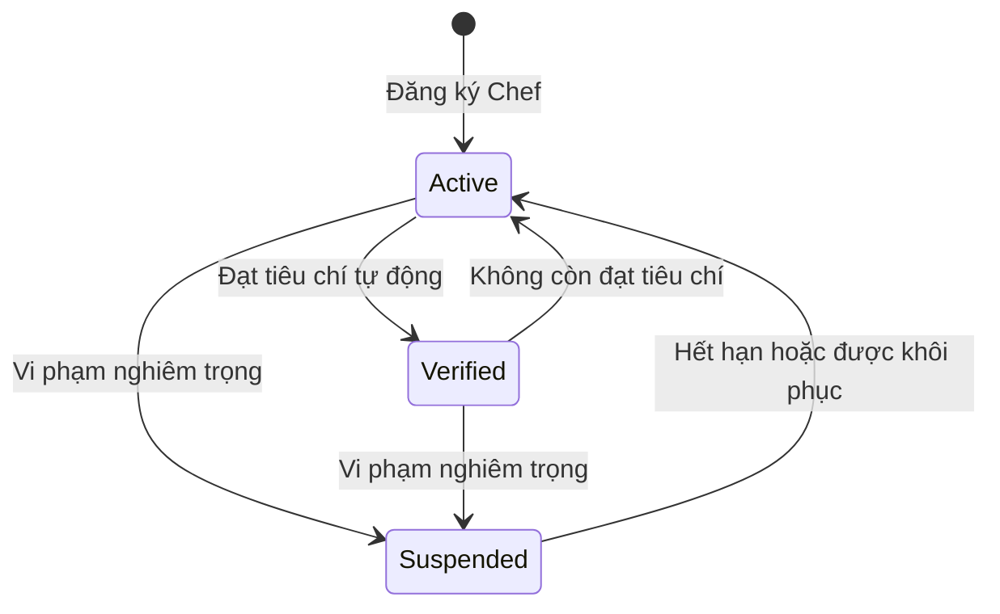
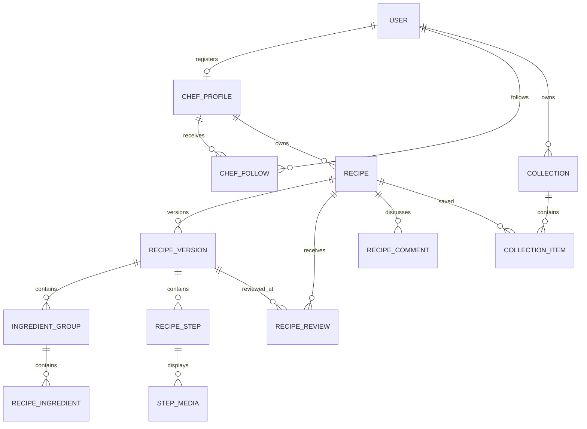
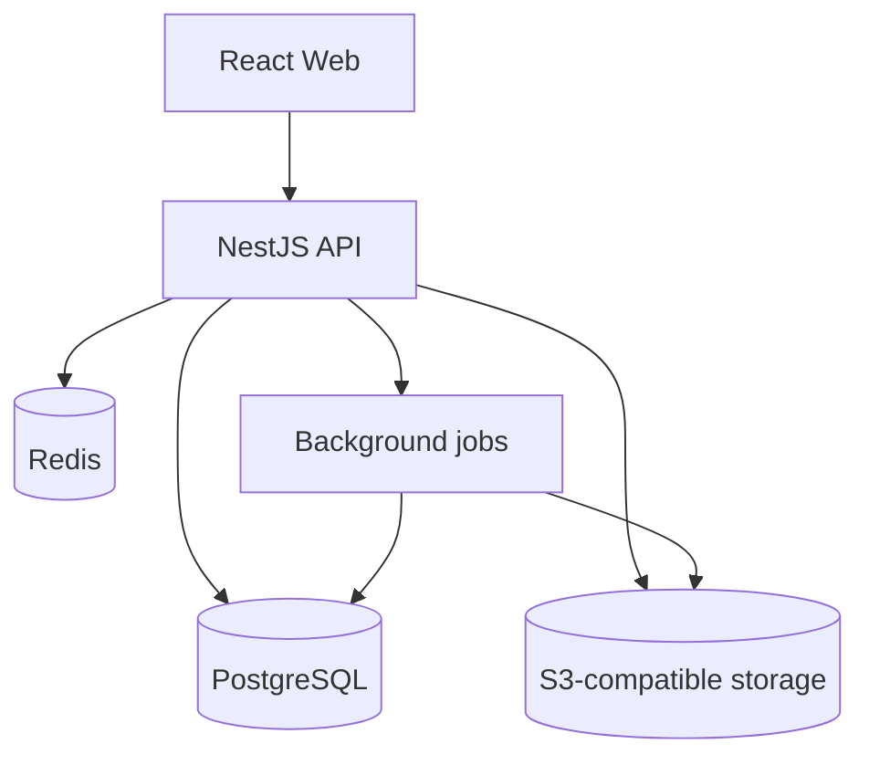

# HOME-COOK — Đặc tả sản phẩm và thiết kế kỹ thuật V1

**Phiên bản tài liệu:** 1.0  
**Trạng thái:** Baseline để bàn giao cho coding agent  
**Công nghệ mục tiêu:** NestJS, React, PostgreSQL, Docker  

---

## 1. Tầm nhìn sản phẩm

Home-cook là nền tảng công thức nấu ăn có cấu trúc, nơi người dùng có thể:

- Tìm, xem và lưu công thức công khai mà không cần đăng nhập.
- Theo dõi Chef yêu thích.
- Đăng ký trở thành Chef và xuất bản công thức có nguyên liệu, khẩu phần, dụng cụ và từng bước chế biến riêng biệt.
- Gắn ảnh hoặc video vào từng bước; video có thể được tải trực tiếp hoặc nhúng từ nền tảng bên ngoài.
- Xác nhận đã nấu để chấm sao và viết review; người chưa nấu chỉ được bình luận.
- Tạo bộ sưu tập công thức cá nhân.

Khác biệt cốt lõi của Home-cook là công thức không phải một khối văn bản. Dữ liệu được chuẩn hóa đủ để tự đổi khẩu phần, chia nhóm nguyên liệu, dùng công thức con, hiển thị bộ đếm giờ và lưu phiên bản chính xác.

## 2. Các quyết định nghiệp vụ đã chốt

| Chủ đề | Quyết định |
|---|---|
| Phạm vi công thức | Công khai cho mọi người, kể cả khách chưa đăng nhập |
| Quyền đăng công thức | User phải đăng ký hồ sơ Chef |
| Chef xác minh | Tự động khi đạt bộ chỉ số tổng hợp; không phải một role riêng |
| Phân phối | Công thức của Chef đã xác minh được ưu tiên có kiểm soát |
| Điều kiện tương tác | User phải đăng nhập |
| Chưa nấu | Được bình luận, không được chấm sao/review |
| Đã nấu | Được tạo review và chấm sao |
| Review | Một review cho mỗi user trên mỗi công thức; được chỉnh sửa |
| Liên kết phiên bản | Review ghi nhận phiên bản công thức đã nấu |
| Chỉnh sửa công thức | Tạo bản nháp mới; bản cũ tiếp tục công khai đến khi bản mới được xuất bản |
| Xóa công thức | Chuyển sang lưu trữ ẩn; Chef có thể khôi phục |
| Nguyên liệu | Chọn từ danh mục chuẩn hoặc nhập nguyên liệu tùy chỉnh |
| Quy trình đăng | Đăng ngay; cộng đồng báo cáo và admin hậu kiểm |
| Media bước nấu | Hỗ trợ tải lên và nhúng URL |
| Tính năng cá nhân V1 | Yêu thích và bộ sưu tập |
| Ngoài phạm vi V1 | Thực đơn tuần, danh sách đi chợ, dinh dưỡng và cảnh báo dị ứng |

## 3. Phạm vi phiên bản V1

### 3.1 Chức năng bắt buộc

1. Đăng ký, đăng nhập, quên/đổi mật khẩu và quản lý hồ sơ.
2. Đăng ký hồ sơ Chef.
3. Follow/unfollow Chef.
4. Tạo, lưu nháp, xem trước, xuất bản, sửa phiên bản và lưu trữ/khôi phục công thức.
5. Công thức có:
   - thông tin cơ bản;
   - khẩu phần và quy đổi định lượng;
   - nhóm nguyên liệu;
   - nguyên liệu chuẩn hoặc tùy chỉnh;
   - công thức con;
   - dụng cụ;
   - các bước có thứ tự;
   - nhiệt độ và bộ đếm giờ theo bước;
   - ảnh/video theo bước;
   - ảnh/video tổng quan.
6. Khám phá, tìm kiếm, lọc và xem chi tiết công thức.
7. Bình luận, review đã nấu và chấm điểm.
8. Yêu thích và bộ sưu tập cá nhân.
9. Báo cáo nội dung và quản trị vi phạm.
10. Tự động xác minh hoặc thu hồi xác minh Chef.
11. Thông báo trong ứng dụng.
12. Dùng i18n để đa dạng ngôn ngữ
### 3.2 Không làm trong V1

- Thanh toán, subscription hoặc tip cho Chef.
- Chat trực tiếp.
- Livestream.
- AI tạo công thức.
- Tự động tính dinh dưỡng và dị ứng.
- Lập thực đơn, tồn kho bếp và danh sách đi chợ.
- Ứng dụng mobile native.
- Kiến trúc microservice.

## 4. Vai trò và quyền

### 4.1 Mô hình quyền

| Đối tượng | Quyền chính |
|---|---|
| Guest | Xem hồ sơ công khai, công thức, tìm kiếm, rating và bình luận |
| User | Mọi quyền Guest; follow Chef, yêu thích, tạo collection, báo cáo nội dung |
| Chef | Mọi quyền User; tạo và quản lý công thức của chính mình |
| Moderator | Xử lý report, ẩn/khôi phục nội dung, áp dụng vi phạm |
| Admin | Quản trị toàn hệ thống, cấu hình tiêu chí xác minh, khóa tài khoản và xem audit log |

`VERIFIED_CHEF` là trạng thái/huy hiệu của hồ sơ Chef, không phải role. Một Chef được xác minh không có thêm quyền quản trị; họ chỉ có huy hiệu và một mức ưu tiên phân phối hữu hạn.

### 4.2 Vòng đời hồ sơ Chef

- User đăng ký Chef bằng cách tạo hồ sơ, chọn slug, mô tả và đồng ý quy tắc cộng đồng.
- Hồ sơ được kích hoạt ngay; không cần admin duyệt trước.
- Việc xác minh chạy định kỳ và sau các sự kiện quan trọng như có review mới hoặc xử lý vi phạm.
- Trạng thái xác minh có `verified_at`, `verification_score` và lý do thay đổi để audit.

## 5. Luồng nghiệp vụ chính

### 5.1 Tạo và xuất bản công thức

1. Chef tạo một `recipe` ở trạng thái `DRAFT`.
2. Hệ thống tạo `recipe_version` số 1 ở trạng thái `DRAFT`.
3. Chef nhập thông tin, nhóm nguyên liệu, bước nấu, dụng cụ và media.
4. Chef lưu nháp bất kỳ lúc nào. Nháp không xuất hiện công khai.
5. Khi chọn xuất bản, backend kiểm tra toàn bộ điều kiện hợp lệ trong một transaction.
6. Version chuyển thành `PUBLISHED`; `recipe.current_published_version_id` trỏ đến version này; recipe chuyển thành `PUBLISHED`.
7. Hệ thống cập nhật search document, feed và các số liệu tổng hợp.

Điều kiện xuất bản tối thiểu:

- Có tiêu đề, mô tả ngắn, ảnh bìa, số khẩu phần lớn hơn 0.
- Có ít nhất một nhóm nguyên liệu và một nguyên liệu hợp lệ.
- Có ít nhất một bước nấu; số thứ tự liên tục, không trùng.
- Media đang upload phải hoàn tất hoặc bị loại khỏi bản xuất bản.
- Công thức con không tạo vòng tham chiếu.

### 5.2 Sửa công thức đã công khai

1. Chef chọn chỉnh sửa; hệ thống sao chép version đang công khai thành một version nháp mới.
2. Trong quá trình sửa, khách vẫn xem version cũ.
3. Chef có thể bỏ bản nháp mà không ảnh hưởng bản đang công khai.
4. Khi xuất bản, version mới nhận số kế tiếp và trở thành `current_published_version_id`.
5. Version cũ chuyển thành `SUPERSEDED` nhưng không bị xóa.
6. Review cũ vẫn ghi nhận version mà reviewer đã nấu.

Mỗi recipe chỉ được có tối đa một version nháp đang hoạt động. Điều này ngăn xung đột giữa nhiều tab hoặc nhiều lần chỉnh sửa.

### 5.3 Review và bình luận

Điều kiện chung tại thời điểm gửi:

- User đã đăng nhập.
- User đang follow Chef sở hữu công thức.
- Recipe đang công khai, không bị ẩn hoặc lưu trữ.

**Bình luận:** không cần xác nhận đã nấu, không có số sao, được tạo nhiều bình luận.  
**Review:** bắt buộc `has_cooked = true`, rating từ 1 đến 5, mỗi user chỉ có một review trên một recipe.

Review lưu `reviewed_version_id` là version đang công khai khi user xác nhận đã nấu. Khi recipe có version mới:

- Review vẫn hiển thị cùng nhãn “Đã nấu phiên bản N”.
- Review vẫn tham gia điểm tổng của recipe.
- User sửa nội dung/rating nhưng mặc định vẫn gắn với version cũ.
- Chỉ khi user xác nhận đã nấu version mới thì hệ thống cập nhật `reviewed_version_id` và lưu thay đổi vào lịch sử review.

Unfollow sau khi đã đăng không tự xóa bình luận/review. User phải follow lại nếu muốn tạo mới hoặc chỉnh sửa.

### 5.4 Lưu trữ và khôi phục

- Chef không xóa cứng recipe qua API thông thường.
- `ARCHIVED` làm recipe biến mất khỏi tìm kiếm, feed, trang Chef công khai và collection của người khác.
- URL công thức trả về trạng thái “Công thức đã được lưu trữ”, không để lộ nội dung.
- Version, review, bình luận, số liệu và report vẫn còn trong database.
- Chef có thể khôi phục về version công khai gần nhất.
- Admin có thể đặt `HIDDEN_BY_MODERATION`; Chef không được tự khôi phục trạng thái này.

### 5.5 Công thức con

Một version có thể tham chiếu một recipe khác làm công thức con, ví dụ “Sốt cà chua cơ bản”.

- Tham chiếu phải khóa vào một `recipe_version_id` cụ thể để nội dung không tự thay đổi ngoài ý muốn.
- Cho phép tham chiếu recipe của Chef khác nếu recipe đó đang công khai.
- Không được tham chiếu chính mình hoặc tạo chu trình A → B → A.
- Nếu recipe con bị lưu trữ sau đó, recipe cha đã xuất bản vẫn giữ snapshot hiển thị tối thiểu; lần xuất bản tiếp theo phải thay thế hoặc loại bỏ tham chiếu không còn hợp lệ.

## 6. Mô hình dữ liệu PostgreSQL

### 6.1 Quy ước chung

- Primary key dùng UUID.
- Thời gian lưu `timestamptz` và ghi theo UTC.
- Các bảng nghiệp vụ chính có `created_at`, `updated_at`.
- Soft delete dùng trạng thái nghiệp vụ hoặc `deleted_at`; không dùng boolean `is_deleted` rải rác.
- Email và slug so sánh không phân biệt hoa thường; dùng `citext` hoặc functional unique index trên `lower(...)`.
- Enum nghiệp vụ nên dùng PostgreSQL enum nếu tập giá trị ổn định; nếu dự kiến thay đổi thường xuyên, dùng varchar + check constraint.
- File không lưu dạng byte trong PostgreSQL. Database chỉ lưu metadata và object key/URL nhúng.

### 6.2 Sơ đồ quan hệ cấp cao

### 6.3 Identity và hồ sơ

#### `users`

| Cột | Kiểu | Ghi chú |
|---|---|---|
| id | uuid PK | |
| email | citext UNIQUE | |
| password_hash | varchar | Không trả về API |
| display_name | varchar(100) | |
| avatar_asset_id | uuid FK nullable | |
| bio | varchar(500) nullable | |
| status | enum | ACTIVE, SUSPENDED, DEACTIVATED |
| email_verified_at | timestamptz nullable | |
| last_login_at | timestamptz nullable | |
| created_at, updated_at | timestamptz | |

#### `user_roles`

- `user_id` FK users
- `role` enum: USER, MODERATOR, ADMIN
- Unique `(user_id, role)`

Chef không cần nằm trong role này; sự tồn tại của `chef_profiles` đang active quyết định quyền đăng công thức.

#### `refresh_tokens`

- `id`, `user_id`, `token_hash`, `family_id`, `expires_at`, `revoked_at`, `replaced_by_id`, `device_info`, `ip_address`, `created_at`.
- Chỉ lưu hash của refresh token; hỗ trợ rotation và phát hiện reuse.

#### `chef_profiles`

| Cột | Kiểu | Ghi chú |
|---|---|---|
| id | uuid PK | |
| user_id | uuid UNIQUE FK | Một user có tối đa một hồ sơ Chef |
| slug | citext UNIQUE | URL công khai |
| display_name | varchar(100) | Có thể khác tên user |
| biography | text | |
| status | enum | ACTIVE, SUSPENDED |
| verification_status | enum | UNVERIFIED, VERIFIED |
| verification_score | numeric(6,2) | 0–100 |
| verified_at | timestamptz nullable | |
| verification_evaluated_at | timestamptz nullable | |
| follower_count | integer | Denormalized |
| published_recipe_count | integer | Denormalized |
| average_rating | numeric(3,2) | Denormalized |
| created_at, updated_at | timestamptz | |

#### `chef_verification_history`

- `id`, `chef_profile_id`, `old_status`, `new_status`, `score`, `metrics_snapshot jsonb`, `reason_code`, `evaluated_at`.
- Bắt buộc lưu snapshot để giải thích vì sao được cấp hoặc thu hồi huy hiệu.

#### `chef_follows`

- `follower_user_id`, `chef_profile_id`, `created_at`.
- Composite PK hoặc unique `(follower_user_id, chef_profile_id)`.
- Check user không follow chính hồ sơ Chef của mình.

### 6.4 Danh mục nguyên liệu và đơn vị

#### `ingredients`

- `id`, `canonical_name`, `slug`, `description`, `status`, `created_by_user_id nullable`, `approved_at nullable`, timestamps.
- Nguyên liệu chuẩn do admin quản lý.
- Nếu Chef nhập tùy chỉnh, không tự động tạo bản ghi chuẩn để tránh danh mục rác.

#### `ingredient_aliases`

- `id`, `ingredient_id`, `alias_name`, `locale`.
- Unique `(lower(alias_name), locale)`.
- Dùng cho tìm kiếm “hành lá” / “hành xanh”, không tự hợp nhất dữ liệu tùy chỉnh.

#### `units`

- `id`, `code`, `name`, `symbol`, `unit_type`, `conversion_factor nullable`, `base_unit_id nullable`, `allows_decimal`.
- `unit_type`: MASS, VOLUME, COUNT, SPOON, CUSTOM.
- Chỉ tự quy đổi giữa đơn vị cùng loại khi có conversion factor đáng tin cậy.

### 6.5 Recipe và version

#### `recipes`

Đây là identity ổn định của công thức, không chứa phần nội dung cần versioning.

| Cột | Kiểu | Ghi chú |
|---|---|---|
| id | uuid PK | |
| chef_profile_id | uuid FK | Chủ sở hữu bất biến trong V1 |
| slug | citext UNIQUE | URL ổn định qua các version |
| status | enum | DRAFT, PUBLISHED, ARCHIVED, HIDDEN_BY_MODERATION |
| current_published_version_id | uuid FK nullable | Version khách đang xem |
| active_draft_version_id | uuid FK nullable | Tối đa một draft |
| published_at | timestamptz nullable | Lần đầu xuất bản |
| archived_at | timestamptz nullable | |
| rating_average | numeric(3,2) | Denormalized |
| rating_count | integer | Chỉ review hợp lệ |
| comment_count | integer | |
| favorite_count | integer | |
| view_count | bigint | |
| created_at, updated_at | timestamptz | |

Do vòng FK giữa recipe và version, migration nên tạo bảng trước rồi thêm FK sau. Backend phải kiểm tra version được trỏ đến thuộc đúng recipe.

#### `recipe_versions`

| Cột | Kiểu | Ghi chú |
|---|---|---|
| id | uuid PK | |
| recipe_id | uuid FK | |
| version_number | integer | Unique cùng recipe |
| status | enum | DRAFT, PUBLISHED, SUPERSEDED |
| title | varchar(180) | |
| summary | varchar(500) | |
| story | text nullable | Nội dung giới thiệu dài |
| cover_asset_id | uuid FK | |
| servings | numeric(8,2) | Khẩu phần gốc |
| serving_unit | varchar(30) | phần, người, chiếc... |
| prep_time_minutes | integer | >= 0 |
| cook_time_minutes | integer | >= 0 |
| difficulty | enum | EASY, MEDIUM, HARD |
| cuisine_id | uuid FK nullable | |
| change_note | varchar(500) nullable | Tóm tắt thay đổi |
| based_on_version_id | uuid FK nullable | Version được sao chép |
| published_at | timestamptz nullable | |
| created_by_user_id | uuid FK | |
| created_at, updated_at | timestamptz | |

Unique `(recipe_id, version_number)`. Partial unique index bảo đảm mỗi recipe chỉ có một version `DRAFT`.

#### `categories`, `cuisines`, `tags`, `recipe_version_categories`, `recipe_version_tags`

- Category là cây phân loại có `parent_id`, ví dụ Món chính → Món nước.
- Cuisine là nền ẩm thực, ví dụ Việt Nam, Nhật Bản.
- Tag là nhãn mềm như “15 phút”, “nồi chiên không dầu”.
- Liên kết category/tag nằm theo version để nội dung tại thời điểm xuất bản có thể tái hiện chính xác.

#### `ingredient_groups`

- `id`, `recipe_version_id`, `name`, `position`.
- Unique `(recipe_version_id, position)`.
- Ví dụ “Phần bánh”, “Phần sốt”.

#### `recipe_ingredients`

| Cột | Kiểu | Ghi chú |
|---|---|---|
| id | uuid PK | |
| ingredient_group_id | uuid FK | |
| ingredient_id | uuid FK nullable | Nguyên liệu chuẩn |
| custom_name | varchar(150) nullable | Nguyên liệu tùy chỉnh |
| quantity_min | numeric(12,4) nullable | |
| quantity_max | numeric(12,4) nullable | Cho khoảng 2–3 |
| unit_id | uuid FK nullable | |
| preparation_note | varchar(250) nullable | băm nhỏ, để mềm... |
| is_optional | boolean | |
| is_scalable | boolean | false với “vừa đủ” |
| position | integer | |

Check constraint yêu cầu đúng một trong `ingredient_id` hoặc `custom_name`. `quantity_max >= quantity_min`. Tự đổi khẩu phần chỉ nhân các dòng có số lượng và `is_scalable = true`.

#### `recipe_tools`

- `id`, `recipe_version_id`, `name`, `quantity nullable`, `note nullable`, `position`.
- V1 cho phép nhập tên tự do; chưa cần danh mục dụng cụ chuẩn.

#### `recipe_steps`

| Cột | Kiểu | Ghi chú |
|---|---|---|
| id | uuid PK | |
| recipe_version_id | uuid FK | |
| position | integer | Bắt đầu từ 1 |
| title | varchar(150) nullable | |
| instruction | text | Nội dung của riêng bước |
| timer_seconds | integer nullable | > 0 |
| temperature_value | numeric(6,2) nullable | |
| temperature_unit | enum nullable | C, F |
| heat_level | enum nullable | LOW, MEDIUM, HIGH |
| tip | text nullable | |
| created_at, updated_at | timestamptz | |

Unique `(recipe_version_id, position)`. Nhiệt độ và mức lửa có thể cùng tồn tại vì một bước có thể vừa quy định nhiệt độ lò vừa mô tả bếp.

#### `sub_recipe_references`

- `id`, `parent_recipe_version_id`, `child_recipe_version_id`, `label`, `serving_multiplier`, `position`.
- Unique `(parent_recipe_version_id, child_recipe_version_id)`.
- Backend kiểm tra đồ thị không có chu trình trước khi xuất bản.

### 6.6 Media

#### `media_assets`

| Cột | Kiểu | Ghi chú |
|---|---|---|
| id | uuid PK | |
| owner_user_id | uuid FK | |
| source_type | enum | UPLOAD, EMBED |
| media_type | enum | IMAGE, VIDEO |
| status | enum | PENDING, READY, FAILED, QUARANTINED, DELETED |
| object_key | varchar nullable | Upload; không lưu public URL cố định |
| embed_provider | enum nullable | YOUTUBE, TIKTOK, OTHER_ALLOWED |
| embed_url | text nullable | URL đã normalize |
| external_id | varchar nullable | ID video từ provider |
| mime_type | varchar nullable | |
| size_bytes | bigint nullable | |
| width, height | integer nullable | |
| duration_seconds | integer nullable | |
| checksum | varchar nullable | Chống upload trùng |
| thumbnail_asset_id | uuid FK nullable | |
| moderation_status | enum | PENDING, APPROVED, REJECTED |
| created_at, updated_at | timestamptz | |

Check constraint phân biệt upload và embed. Upload dùng presigned URL; frontend không đẩy file lớn qua NestJS. Chỉ nhận provider nằm trong allowlist, không render HTML embed do client gửi.

#### `recipe_version_media`

- `recipe_version_id`, `media_asset_id`, `purpose` (COVER, GALLERY), `position`, `caption`.

#### `step_media`

- `recipe_step_id`, `media_asset_id`, `position`, `caption`.

Ảnh/video gắn vào draft chỉ được dọn khi không còn tham chiếu và đã quá thời gian retention. Không xóa asset ngay khi Chef bỏ một bước vì asset có thể đang được version cũ sử dụng.

### 6.7 Review, bình luận và phản hồi

#### `recipe_reviews`

| Cột | Kiểu | Ghi chú |
|---|---|---|
| id | uuid PK | |
| recipe_id | uuid FK | |
| reviewer_user_id | uuid FK | |
| reviewed_version_id | uuid FK | Version đã nấu |
| rating | smallint | Check 1–5 |
| title | varchar(150) nullable | |
| body | text | |
| has_cooked | boolean | Luôn true; check constraint |
| cooked_at | date nullable | |
| status | enum | VISIBLE, HIDDEN_BY_USER, HIDDEN_BY_MODERATION |
| edited_at | timestamptz nullable | |
| created_at, updated_at | timestamptz | |

Unique `(recipe_id, reviewer_user_id)`. Backend đồng thời kiểm tra `reviewed_version_id` thuộc `recipe_id`.

#### `review_revisions`

- `id`, `review_id`, `revision_number`, `reviewed_version_id`, `rating`, `title`, `body`, `cooked_at`, `changed_at`.
- Lưu snapshot trước mỗi lần sửa để audit và xử lý tranh chấp.

#### `review_media`

- `review_id`, `media_asset_id`, `position`.
- Chỉ cho phép ảnh trong V1; tối đa do cấu hình hệ thống quyết định.

#### `recipe_comments`

- `id`, `recipe_id`, `recipe_version_id`, `author_user_id`, `parent_comment_id nullable`, `body`, `status`, timestamps.
- `recipe_version_id` ghi nhận version đang xem lúc bình luận.
- Chỉ hỗ trợ một cấp reply trong UI V1 dù schema có thể lưu cây.

#### `comment_reactions`

- `comment_id`, `user_id`, `reaction_type`, `created_at`.
- Unique `(comment_id, user_id)`; V1 chỉ cần `LIKE`.

### 6.8 Yêu thích và bộ sưu tập

#### `collections`

- `id`, `owner_user_id`, `name`, `description nullable`, `visibility` (PRIVATE, PUBLIC), `cover_asset_id nullable`, timestamps.
- V1 mặc định PRIVATE; có thể bật PUBLIC mà không đổi schema.
- Unique `(owner_user_id, lower(name))` với các collection chưa xóa.

#### `collection_items`

- `collection_id`, `recipe_id`, `note nullable`, `position nullable`, `added_at`.
- Unique `(collection_id, recipe_id)`.
- Item trỏ đến recipe identity nên tự hiển thị version công khai mới nhất.

#### `recipe_favorites`

- `user_id`, `recipe_id`, `created_at`.
- Unique `(user_id, recipe_id)`.
- “Yêu thích” là thao tác nhanh độc lập với collection; UI có thể cho phép thêm tiếp vào collection.

### 6.9 Kiểm duyệt, thông báo và audit

#### `content_reports`

- `id`, `reporter_user_id`, `target_type`, `target_id`, `reason_code`, `details`, `status`, `assigned_moderator_id`, `resolved_at`, `resolution_note`, timestamps.
- `target_type`: RECIPE, REVIEW, COMMENT, CHEF_PROFILE.
- Vì target đa hình không thể dùng FK chuẩn, service phải xác thực target; đồng thời lưu `target_snapshot jsonb` khi xử lý.
- Unique partial index chặn một user gửi nhiều report đang mở cho cùng target.

#### `moderation_actions`

- `id`, `report_id nullable`, `moderator_user_id`, `target_type`, `target_id`, `action_type`, `reason`, `violation_points`, `expires_at nullable`, `created_at`.
- Là nguồn dữ liệu cho việc thu hồi xác minh Chef.

#### `notifications`

- `id`, `recipient_user_id`, `type`, `actor_user_id nullable`, `entity_type`, `entity_id`, `payload jsonb`, `read_at`, `created_at`.
- Dùng payload để render nhanh nhưng không coi payload là nguồn dữ liệu nghiệp vụ.

#### `audit_logs`

- `id`, `actor_user_id nullable`, `action`, `entity_type`, `entity_id`, `before_data jsonb nullable`, `after_data jsonb nullable`, `ip_address`, `user_agent`, `created_at`.
- Bắt buộc cho thay đổi role, khóa tài khoản, moderation và cấu hình xác minh.

### 6.10 Bảng thống kê và tìm kiếm

#### `recipe_daily_stats`

- `recipe_id`, `stat_date`, `views`, `unique_viewers`, `favorites_added`, `reviews_added`, `comments_added`.
- Unique `(recipe_id, stat_date)`.
- Không ghi từng page view vào bảng recipe trong request đồng bộ; gom qua Redis/job để giảm tranh chấp row.

#### `recipe_search_documents`

- `recipe_id`, `recipe_version_id`, `search_vector tsvector`, `normalized_title`, `popularity_score`, `quality_score`, `updated_at`.
- GIN index trên `search_vector`; trigram index trên title và ingredient names đã flatten.

## 7. Ràng buộc dữ liệu quan trọng

Coding agent phải bảo vệ các invariant sau ở cả database lẫn service khi khả thi:

1. Một recipe thuộc duy nhất một Chef.
2. Một recipe chỉ có một draft active và một current published version.
3. Version number tăng đơn điệu trong từng recipe.
4. `current_published_version_id` phải thuộc chính recipe đó và có status PUBLISHED.
5. Version đã PUBLISHED hoặc SUPERSEDED là immutable; không update nội dung tại chỗ.
6. Review version phải thuộc recipe được review.
7. Một user chỉ có một review trên một recipe.
8. Chủ recipe không được review/follow chính mình.
9. Rating chỉ tồn tại trong review đã nấu.
10. Một nguyên liệu dòng phải là chuẩn hoặc tùy chỉnh, không đồng thời cả hai.
11. Recipe version không được tham chiếu công thức con theo chu trình.
12. Chỉ asset READY và đã qua kiểm duyệt mới được xuất bản.
13. Archive không được xóa cascade version/review/comment.
14. Mọi thứ tự trong cùng parent là duy nhất.

Các thao tác publish, archive/restore, tạo review và xử lý moderation phải chạy trong transaction.

## 8. Kiến trúc backend NestJS

### 8.1 Kiến trúc đề xuất

V1 dùng **modular monolith**. Đây là lựa chọn phù hợp vì các transaction giữa recipe, version, ingredient, step và media liên kết chặt; triển khai và debug đơn giản hơn microservice. Ranh giới module vẫn được giữ rõ để có thể tách sau này nếu lưu lượng yêu cầu.

### 8.2 Các module

| Module | Trách nhiệm |
|---|---|
| AuthModule | Đăng ký, đăng nhập, JWT access/refresh, email verification, password reset |
| UsersModule | Hồ sơ user, trạng thái tài khoản |
| ChefsModule | Đăng ký Chef, follow, profile, verification |
| RecipesModule | Recipe identity, draft, publish, archive, restore |
| RecipeVersionsModule | Snapshot version và clone draft |
| IngredientsModule | Danh mục, alias, unit và tra cứu |
| MediaModule | Presigned upload, hoàn tất upload, embed validation, metadata |
| DiscoveryModule | Trang chủ, feed, search, filter, ranking |
| ReviewsModule | Review, revision, rating aggregate |
| CommentsModule | Bình luận, reply và reaction |
| CollectionsModule | Favorite và collection |
| ModerationModule | Report, action, content visibility |
| NotificationsModule | In-app notification |
| AdminModule | Dashboard quản trị và cấu hình |
| JobsModule | Queue consumers, cron verification, media cleanup, aggregate |
| AuditModule | Audit trail cho thao tác nhạy cảm |

Không cho module truy cập repository/bảng của module khác tùy tiện. Giao tiếp qua application service/public interface để tránh modular monolith biến thành một khối phụ thuộc vòng.

### 8.3 Background jobs

- Xử lý thumbnail và metadata video.
- Virus scan/moderation media nếu hạ tầng hỗ trợ.
- Cập nhật search document sau publish.
- Gửi email và notification.
- Gom page views và cập nhật daily stats.
- Tính lại rating/quality score.
- Đánh giá Chef verification theo lịch.
- Dọn upload dang dở và asset không còn tham chiếu.

Job phải idempotent, có retry với exponential backoff và dead-letter state. Không để request publish thành công nếu dữ liệu cốt lõi chưa commit; các tác vụ phụ được phát qua outbox.

#### `outbox_events`

- `id`, `event_type`, `aggregate_type`, `aggregate_id`, `payload jsonb`, `occurred_at`, `processed_at`, `attempt_count`, `last_error`.
- Event được ghi cùng transaction với nghiệp vụ rồi worker xử lý sau, tránh mất notification/indexing event.

## 9. API contract cấp cao

Base path: `/api/v1`. Response lỗi dùng một format thống nhất gồm `code`, `message`, `details`, `requestId`.

### 9.1 Auth và user

- `POST /auth/register`
- `POST /auth/login`
- `POST /auth/refresh`
- `POST /auth/logout`
- `POST /auth/forgot-password`
- `POST /auth/reset-password`
- `GET /users/me`
- `PATCH /users/me`

### 9.2 Chef và follow

- `POST /chefs/register`
- `GET /chefs/:slug`
- `PATCH /chefs/me`
- `POST /chefs/:chefId/follow`
- `DELETE /chefs/:chefId/follow`
- `GET /chefs/:chefId/followers`

### 9.3 Recipe authoring

- `POST /recipes` — tạo recipe + draft version đầu.
- `GET /recipes/mine`
- `GET /recipes/:id/editor`
- `PATCH /recipes/:id/draft` — update metadata draft.
- `PUT /recipes/:id/draft/ingredient-groups`
- `PUT /recipes/:id/draft/tools`
- `PUT /recipes/:id/draft/steps`
- `PUT /recipes/:id/draft/sub-recipes`
- `POST /recipes/:id/publish`
- `POST /recipes/:id/new-draft` — clone current published version.
- `DELETE /recipes/:id/draft` — bỏ draft, không xóa recipe published.
- `POST /recipes/:id/archive`
- `POST /recipes/:id/restore`
- `GET /recipes/:id/versions`

Các endpoint cập nhật collection con có thể nhận toàn bộ ordered list kèm `draftRevision`. Backend dùng optimistic concurrency; nếu revision cũ, trả `409 DRAFT_CONFLICT` thay vì ghi đè âm thầm.

### 9.4 Public discovery

- `GET /recipes/:slug`
- `GET /recipes/:slug/versions/:versionNumber`
- `GET /recipes?query=&category=&cuisine=&difficulty=&maxTime=&sort=&cursor=`
- `GET /feed/discover`
- `GET /feed/following` — yêu cầu đăng nhập.
- `GET /ingredients/search?q=`

Public list dùng cursor pagination cho feed; admin table có thể dùng page/limit. Không trả draft qua endpoint public.

### 9.5 Review và comment

- `PUT /recipes/:recipeId/review` — create hoặc update review duy nhất.
- `GET /recipes/:recipeId/reviews`
- `DELETE /recipes/:recipeId/review` — chuyển HIDDEN_BY_USER.
- `POST /recipes/:recipeId/comments`
- `GET /recipes/:recipeId/comments`
- `PATCH /comments/:id`
- `DELETE /comments/:id`
- `PUT /comments/:id/reaction`

### 9.6 Media

- `POST /media/uploads/initiate`
- Client upload trực tiếp đến object storage.
- `POST /media/uploads/:id/complete`
- `POST /media/embeds/resolve`
- `DELETE /media/:id`

Không tin `mime_type` do client gửi; backend kiểm tra signature, kích thước và metadata thực tế.

### 9.7 Collection, notification, report

- `PUT /recipes/:recipeId/favorite`
- `DELETE /recipes/:recipeId/favorite`
- `POST /collections`
- `PATCH /collections/:id`
- `POST /collections/:id/items`
- `DELETE /collections/:id/items/:recipeId`
- `GET /notifications`
- `POST /notifications/read`
- `POST /reports`

## 10. Ranking và xác minh Chef

### 10.1 Tiêu chí xác minh mặc định đề xuất

Tất cả ngưỡng phải nằm trong bảng cấu hình hoặc admin settings, không hard-code:

- Hồ sơ Chef hoạt động ít nhất 60 ngày.
- Có ít nhất 10 công thức đang công khai.
- Có ít nhất 20 review “đã nấu” từ ít nhất 10 user khác nhau.
- Rating Bayesian tối thiểu 4.2/5.
- Không có moderation action nghiêm trọng đang hiệu lực.
- Tổng violation points trong 90 ngày bằng 0.
- Tỷ lệ công thức bị ẩn do vi phạm dưới ngưỡng cấu hình.

Đề xuất hysteresis để huy hiệu không bật/tắt liên tục: cấp khi score >= 80, chỉ thu hồi do chất lượng khi score < 70 hoặc có vi phạm nghiêm trọng.

### 10.2 Chống thao túng

- Không dùng follower/view thuần làm tiêu chí chính.
- Review từ tài khoản quá mới hoặc có dấu hiệu liên quan bất thường được giảm trọng số.
- Dùng Bayesian rating thay vì trung bình thô để recipe có một review 5 sao không đứng đầu.
- Phát hiện cụm account follow + review trong thời gian ngắn.
- Verified boost là một thành phần nhỏ và có trần; không bảo đảm luôn đứng trước.

### 10.3 Điểm khám phá gợi ý

`ranking_score` kết hợp:

- chất lượng rating đã hiệu chỉnh;
- số review đã nấu hợp lệ;
- tỷ lệ favorite/view;
- độ mới có decay;
- độ phù hợp truy vấn/category;
- mức hoàn thiện công thức;
- verified boost có giới hạn;
- penalty từ report và vi phạm.

Không xếp hạng chỉ bằng tổng view vì sẽ tạo hiệu ứng “giàu càng giàu”.

## 11. Frontend React

### 11.1 Khu vực public

- Trang khám phá.
- Kết quả tìm kiếm và bộ lọc.
- Trang chi tiết recipe với bộ đổi khẩu phần.
- Chế độ nấu từng bước, timer và giữ màn hình sáng nếu trình duyệt hỗ trợ.
- Trang hồ sơ Chef và danh sách recipe.
- Review, bình luận và phiên bản đã được review.

### 11.2 Khu vực user

- Following feed.
- Recipe yêu thích.
- Quản lý collection.
- Notification center.
- Hồ sơ cá nhân và cài đặt tài khoản.

### 11.3 Chef Studio

- Dashboard tóm tắt recipe và tương tác.
- Trình soạn recipe theo tab: cơ bản → nguyên liệu → dụng cụ → bước nấu → media → xem trước.
- Autosave có debounce và chỉ báo `Saving / Saved / Conflict`.
- Reorder bằng drag-and-drop nhưng luôn có nút lên/xuống để bảo đảm accessibility.
- So sánh draft với version đang public.
- Publish checklist hiển thị lỗi theo từng phần.
- Archive/restore có confirmation rõ ràng.

### 11.4 Admin/Moderator

- Queue report theo mức ưu tiên.
- Chi tiết target và snapshot.
- Lịch sử moderation của Chef/user.
- Hành động ẩn/khôi phục, cảnh cáo, suspension.
- Cấu hình ngưỡng xác minh và giới hạn media.
- Audit log không sửa được.

## 12. Hạ tầng Docker

### 12.1 Development compose

| Service | Vai trò |
|---|---|
| frontend | React dev server hoặc nginx build |
| api | NestJS API |
| worker | NestJS application context chạy queue jobs |
| postgres | Database chính |
| redis | Queue, cache, rate limit, view aggregation |
| minio | S3-compatible object storage local |
| mailpit | Kiểm tra email local |

API và worker có thể dùng cùng codebase/image nhưng command khác nhau. Chỉ PostgreSQL và MinIO cần volume bền vững trong local. Không đưa secret thật vào image hoặc git.

### 12.2 Môi trường production

- PostgreSQL managed nếu có thể.
- S3-compatible object storage + CDN cho upload.
- Redis managed cho queue/cache.
- API và worker scale độc lập.
- Migration chạy như release job duy nhất trước khi rollout, không để mọi replica tự migrate.
- Health checks tách `liveness` và `readiness`.
- Backup database tự động, kiểm tra restore định kỳ; object storage bật versioning/lifecycle khi phù hợp.

## 13. Bảo mật và an toàn nội dung

- Access token ngắn hạn; refresh token rotation và revoke theo token family.
- Password hash bằng Argon2id hoặc bcrypt với cost phù hợp.
- Authorization kiểm tra ownership ở service, không chỉ ẩn nút trên React.
- Rate limit riêng cho login, review, comment, follow, report và upload initiation.
- Validate DTO bằng allowlist; giới hạn độ dài mọi text.
- Sanitize nội dung rich text; tốt nhất V1 chỉ nhận plain text/markdown hạn chế.
- CORS chỉ cho origin cấu hình; production dùng HTTPS.
- Presigned upload có giới hạn type, size, expiry và object key do server sinh.
- Chặn SSRF khi resolve embed URL; chỉ gọi domain/provider allowlist.
- Không cho client truyền object key tùy ý.
- CSRF cần xử lý nếu refresh token nằm trong cookie; cookie phải HttpOnly, Secure, SameSite phù hợp.
- Report/audit data chỉ Moderator/Admin truy cập.
- Log không chứa password, token, presigned URL hoặc nội dung nhạy cảm.

Giới hạn media khởi điểm đề xuất, có thể cấu hình:

- Ảnh: JPEG/PNG/WebP, tối đa 10 MB/file.
- Video upload: MP4/WebM, tối đa 200 MB và 5 phút/file.
- Tối đa 10 media tổng quan và 5 media mỗi bước.
- Review V1: tối đa 5 ảnh, không upload video.

## 14. Hiệu năng và khả năng mở rộng

- Index các FK và cột lọc thường dùng.
- Partial index cho recipe PUBLISHED và report OPEN.
- GIN FTS + `pg_trgm` đủ cho V1; chưa cần Elasticsearch.
- Cache recipe public theo `recipe_id + version_id`; publish version mới làm key mới thay vì invalidation phức tạp.
- Counter denormalized được cập nhật transactionally hoặc qua job có reconciliation định kỳ.
- Dùng CDN cho media; API không stream file upload/download thông thường.
- Tránh N+1 khi đọc ingredient groups, steps và media.
- Endpoint recipe detail có thể trả một read model tổng hợp, không bắt frontend gọi hàng chục request.

Các index quan trọng:

- `recipes(chef_profile_id, status, published_at desc)`.
- `recipe_versions(recipe_id, version_number desc)` unique.
- Partial unique draft trên `recipe_versions(recipe_id) WHERE status='DRAFT'`.
- `recipe_reviews(recipe_id, status, created_at desc)` và unique `(recipe_id, reviewer_user_id)`.
- `recipe_comments(recipe_id, status, created_at)`.
- `chef_follows(chef_profile_id, created_at)` và `(follower_user_id, created_at)`.
- `collection_items(collection_id, added_at desc)`.
- GIN `recipe_search_documents(search_vector)`.

## 15. Quan sát hệ thống

- Structured JSON logs có `requestId`, `userId`, route, latency và status code.
- Metrics: request rate/error/latency, DB pool, queue depth, job failures, upload failures, publish failures.
- Tracing giữa API → DB → queue worker nếu hạ tầng hỗ trợ OpenTelemetry.
- Alert cho error rate, database saturation, dead-letter jobs và media processing backlog.
- Audit log khác application log và có thời gian lưu dài hơn.

## 16. Kiểm thử và tiêu chí nghiệm thu

### 16.1 Test layers

- Unit test: scoring, permission, serving scaling, recipe graph cycle detection.
- Integration test với PostgreSQL thật: constraint, transaction, publish/versioning.
- API e2e: auth, ownership, follow requirement, review uniqueness, archive/restore.
- Component/UI test: recipe editor, autosave conflict, reorder, scaling.
- E2E browser: Chef tạo → publish → follower nấu → review → Chef sửa version.

Không dùng SQLite thay PostgreSQL cho integration test vì enum, partial index, citext, FTS và transaction behavior khác nhau.

### 16.2 Các acceptance scenario bắt buộc

1. Guest xem được recipe published nhưng không thấy draft.
2. User thường không thể tạo recipe trước khi đăng ký Chef.
3. Chef sửa recipe không làm thay đổi version khách đang xem.
4. Publish version mới giữ version cũ và review cũ.
5. User không follow không thể comment/review.
6. Follower chưa nấu comment được nhưng không thể gửi rating.
7. Follower đã nấu tạo review 1–5 sao được.
8. User không thể tạo review thứ hai; request tiếp theo cập nhật review hiện có và lưu revision.
9. Review hiển thị đúng version đã nấu sau khi Chef publish version mới.
10. Archive làm recipe biến mất khỏi search/feed nhưng không xóa dữ liệu.
11. Chef khôi phục recipe archived được; không tự khôi phục recipe do moderator ẩn.
12. Công thức con có chu trình bị từ chối.
13. Upload chưa READY không thể nằm trong version published.
14. Hai request publish đồng thời chỉ một request thành công.
15. Verified Chef bị vi phạm nghiêm trọng được thu hồi badge và ghi history.

## 17. Roadmap triển khai

### Phase 0 — Foundation

- Monorepo hoặc hai app rõ ràng; Docker Compose.
- PostgreSQL migrations, seed danh mục tối thiểu.
- Auth, user, RBAC, logging, error format.
- CI chạy lint, typecheck, test và migration check.

### Phase 1 — Recipe core

- Chef registration.
- Recipe draft/editor data model.
- Ingredients, tools, steps, serving scaling.
- Media upload/embed.
- Publish và public recipe detail.

### Phase 2 — Social

- Follow.
- Comment/reply.
- Cooked review, rating aggregate và review history.
- Favorite và collections.
- Notification.

### Phase 3 — Discovery và moderation

- Search/filter/feed/ranking.
- Report queue, moderation actions, audit.
- Verification scoring.
- Stats và dashboard Chef cơ bản.

### Phase 4 — Hardening

- Load test, security review, rate limits.
- Backup/restore drill.
- Accessibility và responsive QA.
- Observability và production runbook.

## 18. Definition of Done cho coding agent

Một feature chỉ hoàn tất khi:

- Có migration thuận và phương án rollback an toàn.
- DTO validation, authorization và ownership đầy đủ.
- Có unit/integration test cho happy path và business rule quan trọng.
- API contract được cập nhật trong OpenAPI.
- Không phát sinh N+1 rõ ràng.
- Có audit cho thao tác nhạy cảm.
- UI xử lý loading, empty, error và conflict state.
- Job async idempotent và có retry policy.
- Không để secret hoặc URL upload nhạy cảm trong log.

## 19. Giả định có thể điều chỉnh mà không đổi kiến trúc

Các giá trị sau là mặc định đề xuất, không phải quyết định nghiệp vụ cố định:

- Rating 1–5 sao.
- Collection mặc định private.
- Ngưỡng và trọng số xác minh Chef.
- Số lượng/kích thước media.
- Số cấp reply comment hiển thị.
- Thời gian giữ upload dang dở.
- Trọng số ranking và verified boost.

Tất cả nên được cấu hình tập trung hoặc qua admin settings. Thay đổi các giá trị này không yêu cầu thiết kế lại schema cốt lõi.

---

## Kết luận kiến trúc

Home-cook V1 nên bắt đầu bằng modular monolith NestJS, PostgreSQL là nguồn dữ liệu chính, Redis cho job/cache, object storage cho media và React cho web app. Recipe identity được tách khỏi immutable recipe versions; đây là nền tảng giúp Chef sửa an toàn, review luôn đúng ngữ cảnh và hệ thống có thể audit. Review và comment được tách riêng để thực thi rõ quy tắc “đã nấu mới được chấm điểm”, còn Chef verification là một cơ chế điểm có lịch sử thay vì role tĩnh.
